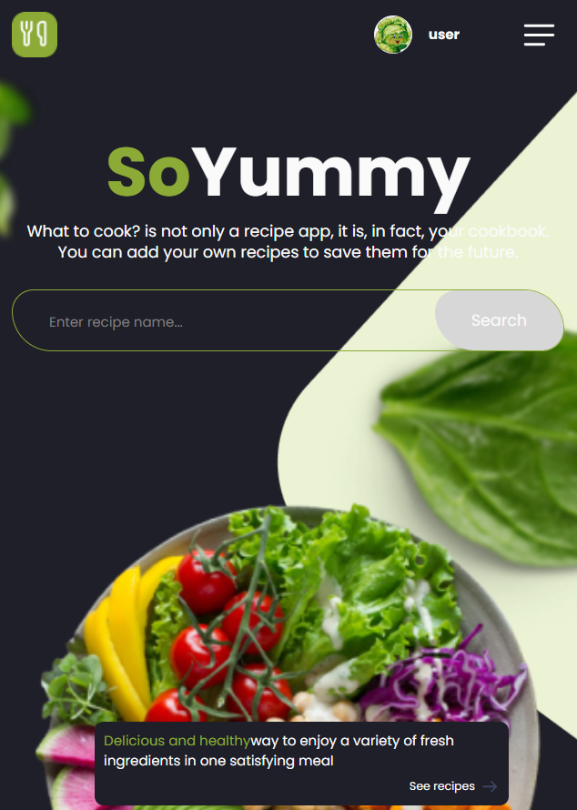
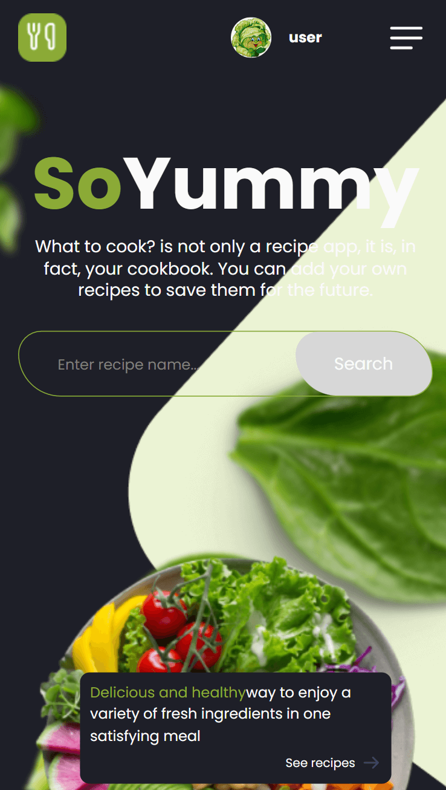
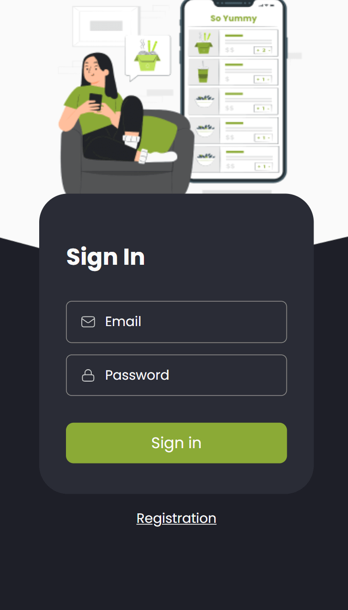
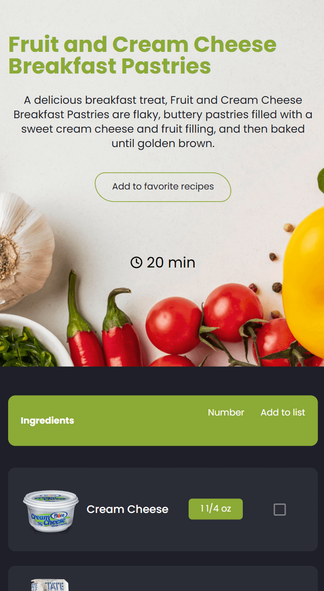

# 🥗 So Yummy - Aplikacja Kulinarna

<div align="center">
  
</div>

## 📝 Opis Projektu

So Yummy to nowoczesna aplikacja kulinarna, która pomaga użytkownikom odkrywać, zapisywać i dzielić się przepisami kulinarnymi. Aplikacja oferuje intuicyjny interfejs użytkownika i szereg funkcji ułatwiających zarządzanie przepisami.

### ✨ Główne Funkcje

- 🔍 Wyszukiwanie przepisów po nazwie lub składnikach
- 📱 Responsywny design (Mobile First)
- 👤 System autoryzacji użytkowników
- ❤️ Zapisywanie ulubionych przepisów
- 📝 Tworzenie własnych przepisów
- 🛒 Lista zakupów
- 🌙 Tryb ciemny/jasny

## 🛠️ Technologie

### Frontend
- React 18
- TypeScript
- Redux Toolkit & Redux Persist
- React Router 6
- Axios
- React Hook Form
- React Select
- React Toastify
- SASS/SCSS Modules

### Backend
- Node.js
- Express
- MongoDB
- JWT Authentication
- Cloudinary

### Narzędzia
- Vite
- ESLint
- Prettier
- Jest
- React Testing Library

## 📸 Screenshots

<div align="center">
  
  
  
</div>

## 🚀 Demo

[Live Demo](https://so-yummy-app.vercel.app/)

## 🔑 Konto testowe

Aby szybko przetestować funkcjonalności aplikacji, możesz skorzystać z przygotowanego konta testowego:

### Dane dostępowe
- **Email**: user@test.pl
- **Hasło**: user1234

### Zawartość konta testowego
- Przykładowe przepisy
- Zapisane ulubione przepisy
- Przygotowana lista zakupów
- Przykładowe kategorie

> **Uwaga**: To konto jest przeznaczone wyłącznie do celów demonstracyjnych. Prosimy o niemodyfikowanie istniejących danych.

## 💻 Instalacja

1. Sklonuj repozytorium:
```bash
git clone https://github.com/your-username/so-yummy.git
```

2. Przejdź do katalogu projektu:
```bash
cd so-yummy
```

3. Zainstaluj zależności:
```bash
npm install
```

4. Utwórz plik .env w głównym katalogu i dodaj wymagane zmienne środowiskowe:
```env
VITE_APP_API_URL=your_api_url
```

5. Uruchom aplikację w trybie deweloperskim:
```bash
npm run dev
```

## 🔧 Dostępne Skrypty

- `npm run dev` - uruchamia aplikację w trybie deweloperskim
- `npm run build` - buduje aplikację do produkcji
- `npm run preview` - podgląd zbudowanej aplikacji
- `npm run lint` - sprawdza kod pod kątem błędów
- `npm test` - uruchamia testy
- `npm run test:coverage` - generuje raport pokrycia testami

## 🌟 Funkcjonalności

### Autoryzacja
- Rejestracja użytkownika
- Logowanie
- Przypomnienie hasła
- Weryfikacja email

### Przepisy
- Przeglądanie przepisów
- Wyszukiwanie po nazwie
- Filtrowanie po kategorii
- Dodawanie własnych przepisów
- Zarządzanie ulubionymi przepisami

### Lista Zakupów
- Dodawanie składników do listy
- Usuwanie składników
- Oznaczanie jako kupione

### Profil Użytkownika
- Edycja danych profilu
- Zmiana avatara
- Przełączanie motywu (ciemny/jasny)

## 📞 Kontakt

Jeśli masz pytania lub sugestie, skontaktuj się z nami:
- Email: contact@example.com
- [GitHub Issues](https://github.com/your-username/so-yummy/issues)